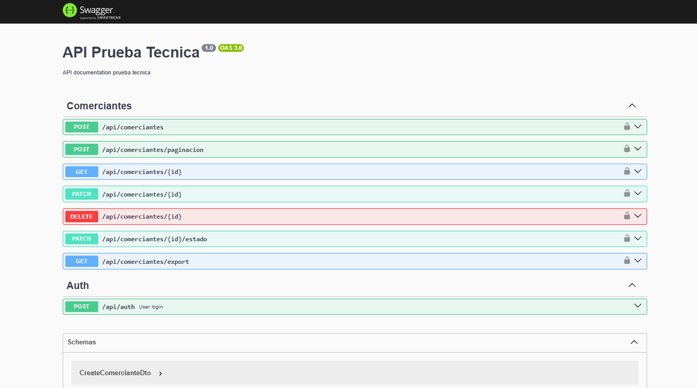

### 2. NEST
Se utiliza la version 11 de NEST y 2O de NODEJS

Se realizaron dos pruebas unitarias con jest, para el controlador y para el servicio de comerciantes

Se implemento Swagger y se puede verificar en la ruta api/docs

Se implemento el dockerfile para el desplieje, y tambien un docker-compose en la ruta anterior para desplejar la aplicacion de NEST Y NEXT a la ves 

#### Añade imagenes

- SWAGGER

- Endpoint de login

- Endpoint get comerciante
