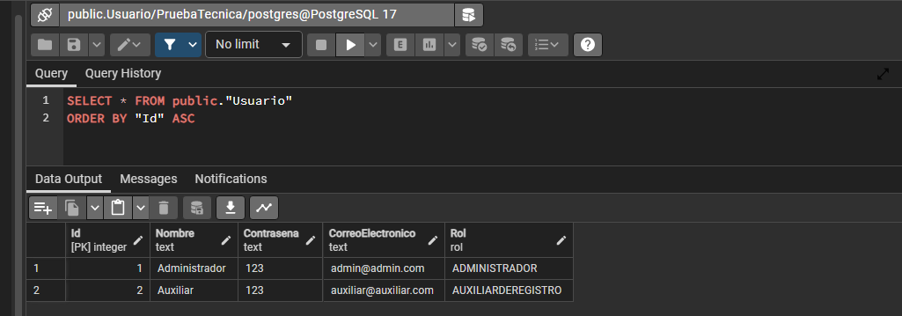
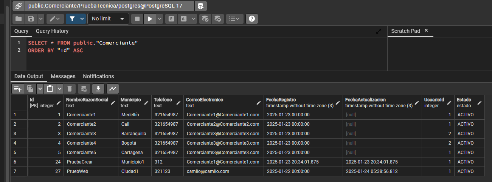
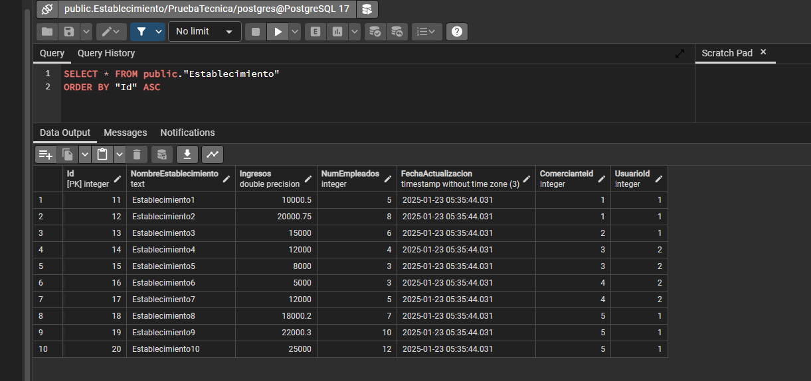

### 1. POSTGRESQL
- Se utiliza la version 17.2 de POSTGRESQL
- En la carpeta POSTGRESQL se encuentra el archivo .sql que contiene las consultas para la prueba de POSTGRESQL

#### Añade imagenes de tablas creadas

- Tabla de Usuarios

- Tabla de comerciantes

- Tabla de establecimientos

