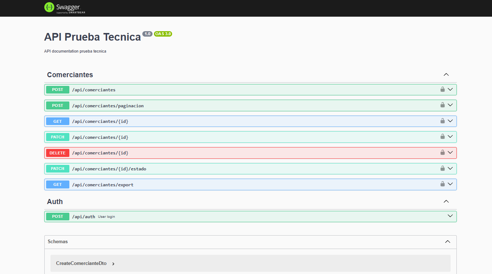
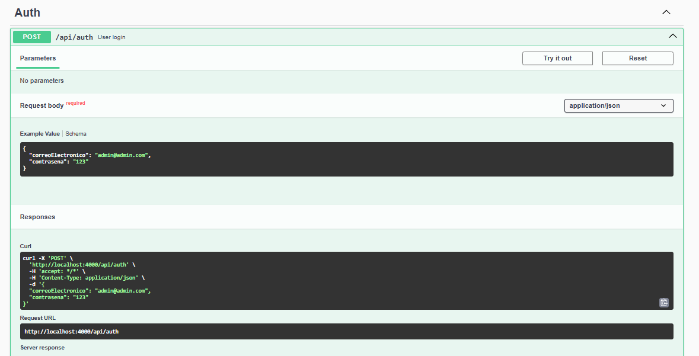
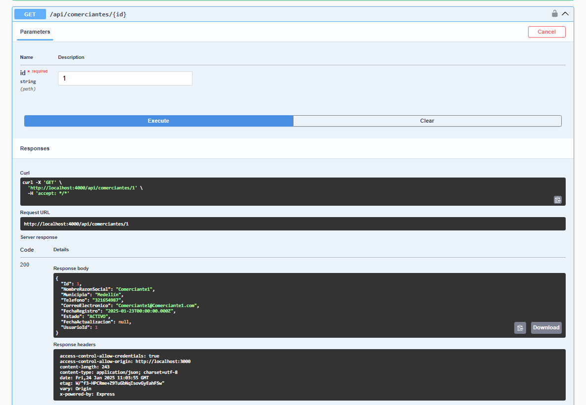
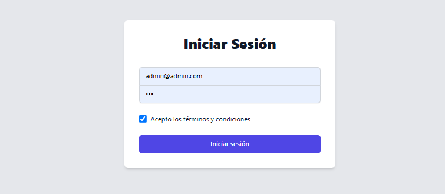
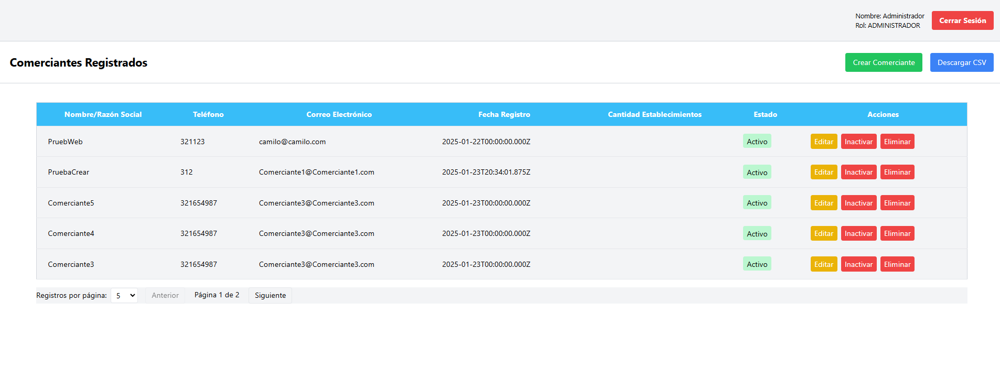
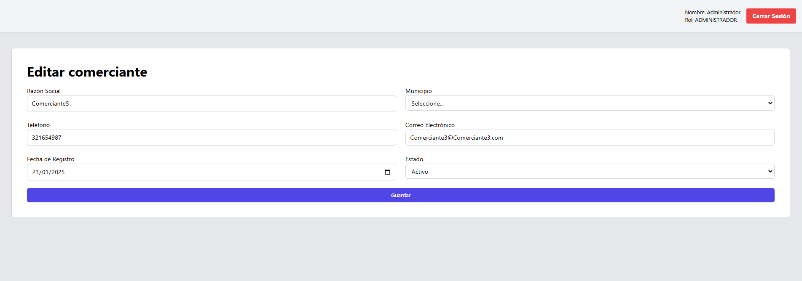

# PruebaTecnica
Repositorio donde esta el codigo fuente de prueba tecnica
Se implemento un docker-compose para desplejar la aplicacion de NEST Y NEXT a la ves 

### 1. POSTGRESQL
- Se utiliza la version 17.2 de POSTGRESQL
- En la carpeta POSTGRESQL se encuentra el archivo .sql que contiene las consultas para la prueba de POSTGRESQL

### 2. NEST
Se utiliza la version 11 de NEST y 2O de NODEJS 

#### Añade imagenes

- SWAGGER

- Endpoint de login

- Endpoint get comerciante

### 3. NEXT
Se utiliza la version 15 de NEXT y 2O de NODEJS

#### Añade imagenes

- Login

- Home

- Editar comerciante
