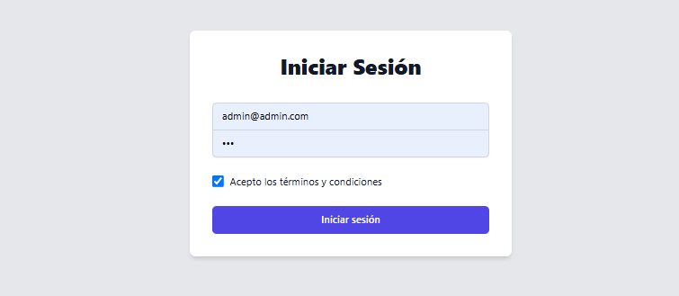

### 3. NEXT
Se utiliza la version 15 de NEXT y 2O de NODEJS

Se realizaron una pruebas unitarias con jest, para el componente de login

Se implemento el dockerfile para el desplieje, y tambien un docker-compose en la ruta anterior para desplejar la aplicacion de NEST Y NEXT a la ves 

#### Añade imagenes

- Login

- Home

- Editar comerciante
